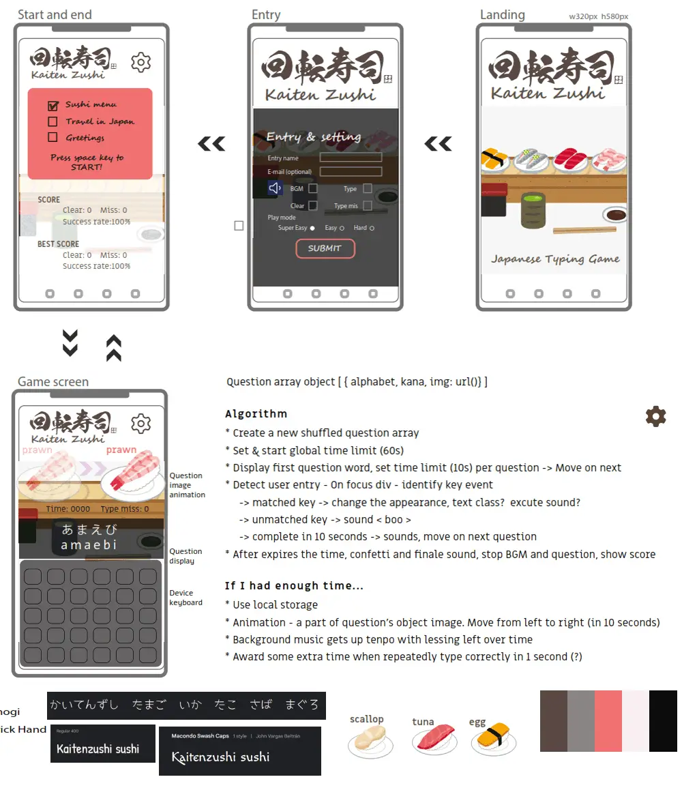

# Kaitenzushi - Japanese Typing Game
Do you like sushi? Are you familiar with Japan? This game is designed not only for practicing speed typing but also for learning the Japanese language and some culture in a fun way.  
  
> This game’s idea is coming from well-known speed typing game “Sushida” (寿司打) in Japan. The game situation is setting to get as much as sushi dishes on the conveyer belt in Kaitenzushi restaurant. You have to hurry as if you are slow or indecisive, you’ll miss your favourite dishes. Original game is made for native Japanese who know the words already, those words and pictures are not related and more focus on typing speed.  [CREDITS - Sushida ](#credits-content) 
  
My challenge is to modify this game and to set the target user for non-native Japanese speaker with introducing basic words with aligned pictures, and give them virtual experience of Kaitenzushi restaurant.

> This website is built for academic purpose only.  

## Live site

**[Live site >> url](url)**

# UX DESIGN

## 1. Strategy Plane
### Target users 
1.	Intended to target the people who are interested in Japan.
2.	Also who are learning Japanese and culture.
3.  Additionally who are not familiar with Japan but simply like to play with speed typing game.

### User value 
1.	Users can find Japaese culture, sushi menu and greeting words etc..
2.	Users can play with speed typing game.
3.	Users can learn the Japanese charactors and words throughout the playing game.

### Difference from substitutions
1.  This game is not typical speed typing game, focusing to learn Japanese words and letters.
2.  Animated images are helping users attractions, to encourage learning.

## 2. Scope Plane 
USER STORIES
### First time visitor
*	As a user, I want to clearly understand what services are offered on this website.
*	As a user, I want to be able to easily navigate through to find contents.
*	As a user, I want the website to work on different devices and formats that I use.
*	As a user, I want a simple sign-up process allowing me to select my preferred option.
*	As a user, I want to .

### Frequent visitor
*	As a user, I want to access the game screen without visiting through few pages.
* As a user, I want to adjust the sound and game modes for any situations.
* As a user, I want to see the scores that played last time or before.

### The website owner stories
*	As a site owner, I want to introduce some Japanese culture.
*	As a site owner, I want to interact users to play games.
*	As a site owner, I want to .
*	As a site owner, I want to 

## 3. Structure Plane

* The website should have a Navigation menu that is consistent across all pages.
* The website should have a fixed footer to access anytime to see this site's SNS.  
* The website should give the user a way to contact through a form.
*	The website should have hover interaction for links, abbreviation, and tooltips with additional information to enhance user experience.
* The landing page should show what this site is offering intuitively.
*
* Setting icon is commonly used on smaller screens, so using this convention suits users' expectations.
*	The submit button should be clearly visible and interactive when the mouse hovers over it. 

## 4. Skeleton Plane

### Wireframes

For the mobile screen wireframe.  

Mobile - 320px - Wireframe

  

Tablet - 768px - and PC - 1440px - Wireframes

  

## 5. Surface Plane

### Colour
I chose this colour scheme, it has a fun and pop image. [CREDITS Content References - Adobe Color API](#credits-content) 
  

### Typography

I wanted to show something fun and  no formal images. 
 [TECHNOLOGY USED - Google Fonts](#tech)  

* "Patrick Hand"  
  

* "Yomogi"  

# EXISTING FEATURES

## The Header And Navigation Bar
........................................
[CREDITS - Code Institute learning material](#credits-content)  

## The Landing Page Hero Image
........................................
[CREDITS - Code Institute learning material](#credits-content)  

## Entering the game setting button
........................................
[CREDITS - Code Institute learning material](#credits-content)   

## The Footer
The footer section includes links to the relevant social media sites. The links will open to a new tab to keep this website still. When this community's activity gets busier this footer allow users easy navigation for anytime they can check recent updates.   

  

## Entry and setting modal
........................................  

| Form input | Criteria |
| -- | -- |
| First name| Texts only |
| Last name | Texts only |
| Phone number | Numbers only |
| Email address | "@" mark necessary |    

[CREDITS - Code Institute learning material](#credits-content) 

## Game course and score modal
........................................
[CREDITS - Code Institute learning material](#credits-content)   

## Game screen

* Word's image animation area  
........................................
[CREDITS - Code Institute learning material](#credits-content)  

* Left over time and score 
........................................
[CREDITS - Code Institute learning material](#credits-content)  

* Question word display  
........................................
[CREDITS - Code Institute learning material](#credits-content)  

* Typing area  
........................................
[CREDITS - Code Institute learning material](#credits-content)  

# FUTURE FEATURES

* Use local storage.  
* The feature - background music gets faster with lessing the time.
* The feature - Award some extra time when repeatedly type correctly in 1 second (?)
  

------------------------------------------

# TECHNOLOGY USED

* HTML
> Used to structure my webpages  

* CSS
> Used to style and add layout  

* GitHub 
> Used for our project's platform 

* GitPod 
> Used as my  Integrated Development Environment (IDE) system

* VS code
> Used for the local coding

* Font Awesome
> Used for all the icons in this project  

* Google Fonts
> Used for all the fonts used in this project and to compare potential fonts.  

* tinify - Smart WebP, PNG and JPEG Compression for Faster Websites
> Used for compress all the image files

* FreeConvert - WebP Converter
> Used for generating webp format

* Am I Responsive? 
> Used for creating responsivity example image

* Adobe Illustrator
> Used for creating wireframes

* Adobe Photoshop
> Used for editing pictures  

# TESTING
> I performed most of the testing myself and had some support from family members with different mobile devices.

**Testing for links, Form and mouse hover reactions**
| Test |Outcome  |
|--|--|
|All links on Navigation and title logo lead to their correct pages| Pass |
|More information >> leads to the each correct page| Pass |
|Footer social links all lead to their respective social media sites in new tabs | Pass |
|Information and sign-up page's breadcrumb leads to the top page | Pass |
|Under the Where to find us section, Sign up form >> leads to Form area | Pass |
|Contact form can be submited when all criteria is filled correctly| Pass |
|User prevented from submitting form without correct elements| Pass |
|Form Validation presents when incorrect input type is entered | Pass |
|All the links and the form have mouse hover reactions | Pass |

**Testing for responsiveness and appearance**
| OS | Browser | Test | Outcome |
|--|--|--|--|
| Windows | Chrome Dev Tools | All pages display correctly on screens larger than 1024px | Pass |
|  |  | All pages display correctly on screens larger than 768px | Pass |
|  |  | All pages display correctly on screens larger than 320px | Pass |
|  |  | All pages display correctly on screens smaller than 320px | Pass |
|  | Edge Dev Tools | All pages display correctly on screens larger than 1024px | Pass |
|  |  | All pages display correctly on screens larger than 768px | Pass |
|  |  | All pages display correctly on screens larger than 320px | Pass |
|  |  | All pages display correctly on screens smaller than 320px | Pass |
|  | Firefox Dev Tools| All pages display correctly on screens larger than 1024px | Pass |
|  |  | All pages display correctly on screens larger than 768px | Pass |
|  |  | All pages display correctly on screens larger than 320px | Pass |
|  |  | All pages display correctly on screens smaller than 320px | Pass |
| Mac | Chrome Dev Tools | All pages display correctly on screens larger than 1024px | Pass |
|  |  | All pages display correctly on screens larger than 768px | Pass |
|  |  | All pages display correctly on screens larger than 320px | Pass |
|  |  | All pages display correctly on screens smaller than 320px | Pass |
|  | Firefox Dev Tools | All three pages display correctly on screens larger than 1024px | Pass |
|  |  | All pages display correctly on screens larger than 768px | Pass |
|  |  | All pages display correctly on screens larger than 320px | Pass |
|  |  | All pages display correctly on screens smaller than 320px | Pass |
|  | Safari v13 | All three pages display correctly on any screens sizes | Fail |
| iPad 8th gen| Chrome | All pages display correctly on screens logical 810px(1620px) | Pass |
|  | Safari v14 | All pages display correctly on screens logical 810px(1620px) | Pass |
| Android Sony Xperia | Chrome | All pages display correctly | Pass |
|  | Edge | All pages display correctly | Pass |
|  | DuckDuckGo | All pages display correctly | Pass |
| Android Xaomi Pocophone | Chrome | All pages display correctly | Pass |
|  | Firefox | All pages display correctly | Pass |
| iPhone 13 | Chrome | All pages display correctly | Pass |
|  | Safari | All pages display correctly | Pass |
| iPhone Xr | Chrome | All pages display correctly | Pass |
|  | Safari | All pages display correctly | Pass |

## W3 Validator

* Top page - index.html  
  

## W3 CSS Validator

* Style sheet - style.css
   

## Google Lighthouse Audit

* Top page - index.html  

Google Lighthouse audit index.html - Device Desktop >> 
  

  

  

# BUGS

## ....................................

................................................ 
  
Solution :   

# DEPLOYMENT

> "Deployment" in web application development refers to the process of making a web application available for end users to access on the internet.  

Git hub - log in >> 
  

  

1. Log in Git hub and access to purpose repository.

In the purpose repository click on.. >> 
  

, side navigation bar (3)")

2. Click on 'Settings' in the top navigaton bar.
3. On the left-hand sidebar, Click on 'Pages'.

In the GitHub Pages, Build and deployment >> 
  

, 'Main' branch (5), 'root'(6),  'save'(7)")

4. Source is 'Deploy from Branch'.
5. Select 'Main' branch.
6. Folder is 'root'.
7. Click 'Save'.

Back to top navigaton bar, left hand side.. >> 
  

")

8. Click on 'Code'. After a few minutes refresh your repo.

Right hand side, aside section.. >> 
  

")

9. On the right-hand side, in the Environments section, click on 'github-pages'.

10. Deployments page click the link to see the live site.

# CREDITS

## Code References

### ........................................  

* [Link to W3school website - CSS Attribute Selectors](https://www.w3schools.com/css/css_attribute_selectors.asp "CSS Attribute Selectors")

<!-- ### Meta Element `<meta http-equiv="X-UA-Compatible" content="IE=edge">`

I researched what is this meta tag for, I guess we might not need this tag anymore though, just in case for the people who are still using old version of IE, it might be better to help them.   

Meta Element X-UA-Compatible - stackoverflow, perplexity

### Figure And Picture Element 

In the upcoming session section, I consider using the `<figure>` element for an image and the `<picture>` element for UI responsivity. But I wasn’t familiar with both elements to use so I looked for some hints. I couldn’t find out how to use both in the W3 school or MDN though there were some coversations at stackoverflow and I also asked perplexity whether I could include picture element in the figure element. It doesn't seem to be a problem to include it. 

Figure And Picture Element - stuckoverflow, perplexity

### Hero Image CSS Animation Scale 1 to 1.1 
When I learned this css animation technique through the “Love Running” project in Code Institute, I was amazed to discover that I could create animation without Java Script, which was common 20 years ago. 

Hero Image CSS Animation - “Love Running” project in Code Institute

### Breadcrumb
I looked for suitable elements for the breadcrumb links. In W3 website the answer was `<nav>` and using aria attribute for describing the location. Moreover I got an opportunity to learn about `::before` pseudo selector in relation to this.  

* [Link to "::before / ::after" - CSS TRICKS ](https://css-tricks.com/almanac/selectors/a/after-and-before/)

 

### Form  Autocomplete Attribute
Google Lighthouse audit suggested me to use autocomplete attribute for form, and I found this is really helpful for user.  

* [Link to MDN website - Form autocomplete attribute](https://developer.mozilla.org/en-US/docs/Web/HTML/Attributes/autocomplete "Form autocomplete attributer")

### Form Input Pattern Attribute
My mentor Alan taught me about this `<input>` pattern attribute for preventing invalid form data submission.
EG. for alphabet only and 3 letters `pattern="[A-Za-z]{3}"`  

* [Link to W3schools website - Form input pattern attribute](https://www.w3schools.com/tags/att_input_pattern.asp#:~:text=The%20pattern%20attribute%20specifies%20a,pattern%20to%20help%20the%20user "Form input pattern attribute")

### Hero Image Optimizing For LCP
The hero image is not a small size image. After I read this article, I tried to optimize the reading time of the hero image using `<link rel="preload">` for increasing LCP score.  

* [Link to web.dev - Optimize Largest Contentful Paint](https://web.dev/articles/optimize-lcp?utm_source=lighthouse&utm_medium=lr#optimize_when_the_resource_is_discovered "Optimize Largest Contentful Paint")
 -->  
 
### Clearfix using ::after pseudo selector
..................................................... 

* [Clearing and Containing Floats - Responsive Web Design](url "Clearing and Containing Floats - Responsive Web Design")

## Content References

* Sushida - Japanese speed typing game  

Sushida - Japanese speed typing game1

  

Sushida - Japanese speed typing game2

  

  

* Code Institute Learning Material
> [Link to Code Institute Full-Stack Software Development Program](https://codeinstitute.net/?nab=0 "Code Institute Full-Stack Software Development Program")

* Adobe color API  
> [Link to Adobe Color EXPLORE 'food' keyword ](https://color.adobe.com/search?q=food "Adobe Color EXPLORE 'food' keyword")

* W3schools
> Used to research codes

* MDN
> Used to research codes

* stackoverflow
> Used to research codes

* CSS TRICKS
> Used to research codes

* web.dev
> Used to research code and knowledge

* Responsive Web Design
> Used to research codes

* perplexity
> Used for general questions

## Imagery

<!-- * Hero image  
<a href="https://www.freepik.com/free-photo/young-smiling-woman-making-bruschetta-with-healthy-ingredients-while-preparing-food-kitchen_25777232.htm#fromView=search&page=1&position=49&uuid=0bc03e1b-f752-44c6-9880-1b484845ce49" width="500">Image by Drazen Zigic on Freepik</a>

 -->

## Editing and Proofreading
Since I am not a native English speaker, my family assisted me with editing and proofreading.
 [ACKNOWLEDGEMENTS](#acknowledgements)  

# ACKNOWLEDGEMENTS  

I would like to give great thanks to my mentor Alan Bushell and cover session's mentor Chris Quinn for their exellent advice and support.  
Also my cohort facilitator Amy Richardson for all the support and assistance.  

And great thanks to my family Sean Coffey and Dean Coffey for all the support.

<!-- 

Welcome,

This is the Code Institute student template for Codeanywhere. If you are using Gitpod then you need [this template](https://github.com/Code-Institute-Org/gitpod-full-template) instead.  We have preinstalled all of the tools you need to get started. It's perfectly ok to use this template as the basis for your project submissions.

You can safely delete this README.md file, or change it for your own project. Please do read it at least once, though! It contains some important information about Codeanywhere and the extensions we use. Some of this information has been updated since the video content was created. The last update to this file was: **August 30th, 2023**

## Codeanywhere Reminders

To run a frontend (HTML, CSS, Javascript only) application in Codeanywhere, in the terminal, type:

`python3 -m http.server`

A button should appear to click: _Open Preview_ or _Open Browser_.

To run a frontend (HTML, CSS, Javascript only) application in Codeanywhere with no-cache, you can use this alias for `python3 -m http.server`.

`http_server`

To run a backend Python file, type `python3 app.py`, if your Python file is named `app.py` of course.

A button should appear to click: _Open Preview_ or _Open Browser_.

In Codeanywhere you have superuser security privileges by default. Therefore you do not need to use the `sudo` (superuser do) command in the bash terminal in any of the lessons.

To log into the Heroku toolbelt CLI:

1. Log in to your Heroku account and go to _Account Settings_ in the menu under your avatar.
2. Scroll down to the _API Key_ and click _Reveal_
3. Copy the key
4. In Codeanywhere, from the terminal, run `heroku_config`
5. Paste in your API key when asked

You can now use the `heroku` CLI program - try running `heroku apps` to confirm it works. This API key is unique and private to you so do not share it. If you accidentally make it public then you can create a new one with _Regenerate API Key_.

---

Happy coding! -->
