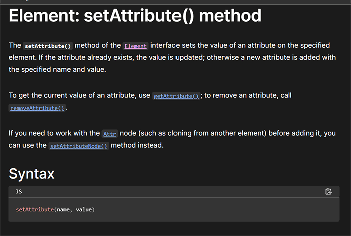

# Kaitenzushi - Japanese Typing Game
Do you like sushi? Are you familiar with Japan? This game is designed not only for practicing speed typing but also for learning the Japanese language and some culture in a fun way.  
  
> This game’s idea is coming from well-known speed typing game “Sushida” (寿司打) in Japan. The game situation is setting to get as much as sushi dishes on the conveyer belt in Kaitenzushi restaurant. You have to hurry as if you are slow or indecisive, you’ll miss your favourite dishes. Original game is made for native Japanese who know the words already, those words and pictures are not related and more focus on typing speed.  [CREDITS - Sushida ](#credits-content) 
  
My challenge is to modify this game and to set the target user for non-native Japanese speaker with introducing basic words with aligned pictures, and give them virtual experience of Kaitenzushi restaurant.

> This website is built for academic purpose only.  

## Live site

**[Live site >> https://atsukocoffey.github.io/kaitenzushi/](https://atsukocoffey.github.io/kaitenzushi/)**

# UX DESIGN

## 1. Strategy Plane
### Target users 
1.	Intended to target the people who are interested in Japan.
2.	Also who are learning Japanese and culture.
3.  Additionally who are not familiar with Japan but simply like to play with speed typing game.

### User value 
1.	Users can find Japaese culture, sushi menu and greeting words etc..
2.	Users can play with speed typing game.
3.	Users can learn the Japanese charactors and words throughout the playing game.

### Difference from substitutions
1.  This game is not typical speed typing game, focusing to learn Japanese words and letters.
2.  Animated images are helping users attractions, to encourage learning.

## 2. Scope Plane 
USER STORIES
### First time visitor
*	As a user, I want to clearly understand what is offered on this website.
*	As a user, I want to be able to easily navigate through to find contents.
*	As a user, I want the website to work on different devices and formats that I use.
*	As a user, I want a simple sign-up process.
* As a user, I want to know what the pictures and Japanese mean in English.
*	As a user, I want to see my time limit for game clearly.
*	As a user, I want to change sounds ON/OFF setting anytime even game started too.
*	As a user, I want to know whether my typing is correct or not.
*	As a user, I want to know if the word I could type completed or not.
*	As a user, I want to see my results clearly.

### Frequent visitor
*	As a user, I want to access the game screen without visiting through few pages.
* As a user, I want to adjust the sound and game modes for any situations.
* As a user, I want to see my best score that played last time or before.

### The website owner stories
*	As a site owner, I want to introduce some Japanese culture.
*	As a site owner, I want to interact users to play games.

## 3. Structure Plane
* The website should have a clear logo or header .
* The website should have a fixed footer to access anytime to see this site's SNS.  
*	The website should have hover interaction for links, and tooltips with additional information to enhance user experience.
* The landing page should show what this site is offering intuitively.
*	The submit button should be clearly visible and interactive when the mouse hovers over it. 

## 4. Skeleton Plane

### Wireframes

For the mobile screen wireframe.  

Mobile - 320px - Wireframe

  
  

## 5. Surface Plane

### Colour
I chose this colour scheme, it has a fun and pop image. [CREDITS Content References - Adobe Color API](#credits-content) 
  

### Typography

I pick up some fonts at Google Fonts, I wanted to show something fun and not formal atmonphere.  
 [TECHNOLOGY USED - Google Fonts](#tech)  

* "Patrick Hand"  Typing display English font.   
    
   
* "Yomogi"  Typing display Japanese font.   
   
   
* "Caveat"  Using for headings.   
   
   
* "Delius"  Using for site logo.     
    
   

# EXISTING FEATURES

## The Header And Sound Control Bar      
The logo is wrinting "Kaiten zushi" in Japanese. I looked for some ordinary real flags and banners for Kaitenzushi reataurant, then traced and arraged to use. English logo shows a little bit more groovy also the bottom lines feel speed so I thought this fit well to speed typing game.   
     

## The Landing Hero Image    
Originally this feature was separate 2 before, then I wanted to simplify and less action for the user so I used `setTimeout`
to automatically show name input modal. This is not the best way as it looks like just loading problem, not clear it's intended to show like this. If I could use some css animation for this transition, it could be more smooth though I think. 

   

## Entering the game setting button
Originally I planned another course that can learn Japanese greetings and frases though I couldn't figure it out of the choosing functions in Javascript. The mode option is same, I need more time to figure it out so end up only one option both.   

   

## The Footer  
The footer section includes links to the relevant social media sites. The links will open to a new tab to keep this website still. Also the heading text "Japanese word typing game" explains what is this site so shows up all the time in the footer.   

   

## Entry and setting modal
........................................  

| Form input | Criteria |
| -- | -- |
| First name| Texts only |
| Last name | Texts only |
| Phone number | Numbers only |
| Email address | "@" mark necessary |    

[CREDITS - Code Institute learning material](#credits-content) 

## Game course and score modal
........................................
[CREDITS - Code Institute learning material](#credits-content)   

## Game screen

* Word's image animation area  
........................................
[CREDITS - Code Institute learning material](#credits-content)  

* Left over time and score 
........................................
[CREDITS - Code Institute learning material](#credits-content)  

* Question word display  
........................................
[CREDITS - Code Institute learning material](#credits-content)  

* Typing area  
........................................
[CREDITS - Code Institute learning material](#credits-content)  

# ALGORITHM
Below numbered lists are my original idea of the game system. Also just underneath the list, [BUG] sentences that describe the main problems with the features.   
 
I had never created a whole game before, so I was unsure if this was achievable within the given time or not. As a precaution, I set lower accomplish goal to prepare for submitting anytime. After that then I can try extra features that I hope I can implement until submission day. On the other hand, Japanese kana letter matching function was more complicated than I expected so I decided to make it an extra feature.  
 
**1. Create a new shuffled question**    
[BUG](#bugs) Just random array -> I want shuffle properly ->  
 
**2. Set & start Global time limit (60s)**  
[BUG](#bugs)  

**3. Display first question image & texts**   
[BUG](#bugs) display images  
 
**4. Set one word timer (10s) per question -> Move on next**  
[BUG](#bugs) After complete the word still that time limit is working -> This time limit need to be cancelled when next question is executed.  
 
**5. Detect user entry - Set on focus to input, set window.event to identify the key**   
[BUG](#bugs) keyboard nor input event didn't work for mobile device (I didn't want to use button)   
  
**6. Input key matching -> matched key -> Letter matched counter +1, change the display using css, executes typing sound**   
[BUG](#bugs) Changing the colour of a letter one by one in the word seems impossible.    
My solution is using an another layer which was applied the style already, push the matched letter in it to look like to change the letter colour one by one.   
[BUG](#bugs) Mobile device doesn't work the matching function as the keyboard system is different. Temporary, use return key to lead to validate function for mobile phone.  
[BUG](#bugs) Matching function for Japanese kana letters were much more complicated than I expected. I tried some if statement though decided to postpone to try later. 
 
**7. Change user entry to the lower case**  
  
**8. Automatically clear the input area after (0.5 s)**  
 
**9. Unmatched key -> sound < boo > , mistake counter**  
 
**10. Validate the word function - If matched word counter + 1 and start new game. Reset the letter counter to 0**   
[BUG](#bugs) Because input key matching `hundleKeyPress()` did not function for mobile device, make this can handle 2 ways of  validations.   
[BUG](#bugs) `innerText` and `value` property.  

## If I had enough time...
* Use local storage
* Animation - Question’s word image. Move from left to right (in 10 seconds)
* Award some extra time when repeatedly type correctly (booster)

# FUTURE FEATURES

* Another course - Not only sushi menu, Japanese greetings or words  
* The feature - Image picture animation 
* Japanese kana overlay - Changeellow colour words 
* The feature - Award some extra time when repeatedly type correctly in 1 second (?)
  

------------------------------------------

# TECHNOLOGY USED

* HTML
> Used to structure my webpages  

* CSS
> Used to style and add layout  

* GitHub 
> Used for our project's platform 

* GitPod 
> Used as my  Integrated Development Environment (IDE) system

* VS code
> Used for the local coding

* Font Awesome
> Used for all the icons in this project  

* Google Fonts
> Used for all the fonts used in this project and to compare potential fonts.  

* tinify - Smart WebP, PNG and JPEG Compression for Faster Websites
> Used for compress all the image files

* FreeConvert - WebP Converter
> Used for generating webp format

* Am I Responsive? 
> Used for creating responsivity example image

* Adobe Illustrator
> Used for creating wireframes

* Adobe Photoshop
> Used for editing pictures  

# TESTING
> I performed most of the testing myself and had some support from family members with different mobile devices.

**Testing for links, Form and mouse hover reactions**
| Test |Outcome  |
|--|--|
|All links on Navigation and title logo lead to their correct pages| Pass |
|More information >> leads to the each correct page| Pass |
|Footer social links all lead to their respective social media sites in new tabs | Pass |
|Information and sign-up page's breadcrumb leads to the top page | Pass |
|Under the Where to find us section, Sign up form >> leads to Form area | Pass |
|Contact form can be submited when all criteria is filled correctly| Pass |
|User prevented from submitting form without correct elements| Pass |
|Form Validation presents when incorrect input type is entered | Pass |
|All the links and the form have mouse hover reactions | Pass |

**Testing for responsiveness and appearance**
| OS | Browser | Test | Outcome |
|--|--|--|--|
| Windows | Chrome Dev Tools | All pages display correctly on screens larger than 1024px | Pass |
|  |  | All pages display correctly on screens larger than 768px | Pass |
|  |  | All pages display correctly on screens larger than 320px | Pass |
|  |  | All pages display correctly on screens smaller than 320px | Pass |
|  | Edge Dev Tools | All pages display correctly on screens larger than 1024px | Pass |
|  |  | All pages display correctly on screens larger than 768px | Pass |
|  |  | All pages display correctly on screens larger than 320px | Pass |
|  |  | All pages display correctly on screens smaller than 320px | Pass |
|  | Firefox Dev Tools| All pages display correctly on screens larger than 1024px | Pass |
|  |  | All pages display correctly on screens larger than 768px | Pass |
|  |  | All pages display correctly on screens larger than 320px | Pass |
|  |  | All pages display correctly on screens smaller than 320px | Pass |
| Mac | Chrome Dev Tools | All pages display correctly on screens larger than 1024px | Pass |
|  |  | All pages display correctly on screens larger than 768px | Pass |
|  |  | All pages display correctly on screens larger than 320px | Pass |
|  |  | All pages display correctly on screens smaller than 320px | Pass |
|  | Firefox Dev Tools | All three pages display correctly on screens larger than 1024px | Pass |
|  |  | All pages display correctly on screens larger than 768px | Pass |
|  |  | All pages display correctly on screens larger than 320px | Pass |
|  |  | All pages display correctly on screens smaller than 320px | Pass |
|  | Safari v13 | All three pages display correctly on any screens sizes | Fail |
| iPad 8th gen| Chrome | All pages display correctly on screens logical 810px(1620px) | Pass |
|  | Safari v14 | All pages display correctly on screens logical 810px(1620px) | Pass |
| Android Sony Xperia | Chrome | All pages display correctly | Pass |
|  | Edge | All pages display correctly | Pass |
|  | DuckDuckGo | All pages display correctly | Pass |
| Android Xaomi Pocophone | Chrome | All pages display correctly | Pass |
|  | Firefox | All pages display correctly | Pass |
| iPhone 13 | Chrome | All pages display correctly | Pass |
|  | Safari | All pages display correctly | Pass |
| iPhone Xr | Chrome | All pages display correctly | Pass |
|  | Safari | All pages display correctly | Pass |

## W3 Validator

* Top page - index.html  
  

## W3 CSS Validator

* Style sheet - style.css
   

## Google Lighthouse Audit

* Top page - index.html  

Google Lighthouse audit index.html - Device Desktop >> 
  

  

  

# BUGS

## Create a new shuffled question  `shuffledWords()`
First I found this to shuffle in stackoverflow `const randomElement = array[Math.floor(Math.random() * array.length)];`   
 
   
    
But that creates a random array literally and what I wanted was to shuffle properly, meaning I didn't want to show the same word a few times in the array. I tried using `pop` and `push`, but I couldn’t find out a better way or a popular convention.   
 
Solution : **Fisher Yates Shuffle**   
 
 
## Set & start Global time limit `startGame()`  
I implement the reset code that clears out the display texts and the input texts in the start game function. Then, I got an error which  `innerText` property wasn't working well.   

   
 
Solution :   
The difference between `innerText` and `value` property was that value was used for form elements.
 
## Display first question image & texts   
I was wondering how to hold image’s data in the array, but after this researching, I found that what I needed it was a just text path. It wasn't difficult than I thought. But after implemented it I got link error. Because I was writing in assets’ JavaScript file, even though this code will be executed from index.html    
 
Solution :  
Fix the path from index.html  
 
## Set one word timer (10s) per question -> Move on next word   
My global timer which executes when the page is loaded, is working fine so I tried to use the `setTimeout` method same way. But for one word timer it didn't work well with `clearTimeout` method. This timer need to be cancelled when next question is executed or users have completed the typing successfully. Under below was an article at stackoverflow, I understand the variable should be in global scope but my code didn't use any variable. I looked for MDN or W3chool but still I didn't find out my problem. So I asked to perplexity, it explained me really well what was my problem.   
   
   
   
 Solution :   
Use a variable to make sure that the correct `setTimeout` identifier for passing to `clearTimeout` 
 
  
## Input key matching `handleKeyPress()` 
This function finds matched key, then if there's add +1 to the Letter counter, then change the display using css, executes typing sound.    
My original plan "changing the colour of a letter one by one in the word" seems difficult if the data is already a word.    
My solution was using the another layer which was applied the style already, push the matched letter in it to look like to change the letter colour one by one.   
[BUG](#bug-handleKeyPress) Mobile device doesn't work the matching function, maybe the keyboard system is deffent. Temporary, use keyboard "return" key to lead to validate function for mobile phone.   
[Future feature](#future-features) Matching function for japanese kana letters were much more complicated than I expected. I tried some if statement though decided to postpone to try later in the future.   

## Detect user entry - Set on focus to input, set window.event to identify the key     
[BUG]`keypress` nor `input` event listener didn't work for mobile device (I didn't want to use button for visual purpose)  
I spent long time to dealing with this issue, I tried to use `touchstart` `touchend` `click` as well.
Finally I could solve this issue after I learned `target` property from tutor Sean at [BUG](bug-audiocontroll) AUDIO CONTROL CHECKBOXES 
This issue is related to "Input key matching `handleKeyPress()`" too.
 
## Change user entry to the lower case   
I found the input from the mobile phone, usually auto Capitalise first letter. That interupts to play game. I set `toLowerCase()` in Javascript, but some mobile devises not work (I assume this because not using `target` property). My mentor Alan teach me about this auto capitalise off attribute.   
   

## Unmatched key -> sound < boo > , mistake counter   
![]
 
## Validate the word function `validateInput()` 
If matched word counter + 1 and start new game. Reset the letter counter to 0   
[BUG] Because input key matching `hundleKeyPress()` did not function for mobile device, I made this can handle both ways of validations.    
 
Solution : 
Set conditons for keyboard and use `||` logical operator to mobile device. Keyboard validation can use the overlay text which were generated by mey matching function though mobile validation use direct user input data.    
  
Later I found this function wasn't working in the mobile device, because same issu as `startGame()`   

[BUG] `innerText` and `value` property.  

Stopped the correct letter counting at `handleKeyPress` one by one. So I tried to add the letter counter's number when validate the word. How ever, `textDisplay.length` wasn't a number. I found the using console to checking is really useful.    

## DIsplay of the global time limits

   

## AUDIO CONTROL CHECKBOXES

When I was working on this audio control checkbox, it was just the timing to Gitpod migration. I made a commitment though it wasn’t succeeded in my new Gitpod environment. I noticed the terminal text's colour was different but I didn’t really look at the warning by my mistake. I want to leave my track here for detail references.
Beforehand I implemented the `turnOnSound()` function to see the checkbox can control the audio files. There were 5 audio files so I used for loop to iterate to go through each other. At this time code was really simple, using just if statement and iterate `muted = false` all the checkboxes. So this time I duplicated the checkboxes into the nav toggle header menu. What I wanted to do was the linking those same function buttons. If a checkbox at main div was checked then header nav’s same function checkbox is checked automatically along with audio control. There are 3 types of controls and all duplicated so same function’s checkboxes are 2 each, I tried to get the array from get ElementsByClassName, and specify with using index number to connect to 3 different functions. Also added event listener `click` and use `if statement` to toggle the audio muted attribute; automatically checked or unchecked. Strangely it worked half way. When I checked the other checkbox was checked automatically and audio controlling OK, but can’t uncheck again and not control audio anymore. For a while I tried to solve it but didn’t work, and this point I failed to the commitment.
Tutor Sean at Tutor support helped me to solve this problem, he checked one by one my code and he suggested me to use event listener “change” also using “event.target” then this checkbox worked properly. Also he used .forEach method even only 2 in the array, it might be simpler than specify one by one.

## TYPING AREA – INPUT TEXT AREA FOR MOBILE KEYBOARD ISSUE
From Audio control bug I learned `change` event listener and using `event.target` to specify precisely that solved some errors. I had an issue with mobile devise only, both `validateInput()` and `handleKeypress()` functions didn’t work properly. I thought it might be similar problem so I asked this issue to tutor support again. I was trying to fix this issue long time with using event listener `input` `keypress` `touchstart` `touchend`. Tutor Sean suggested me to use `change` or `keydown` `keyup`. `keydown` worked for Mac OS mobiles, iPhone and iPad, but I found it didn’t work for android OS later.
I tried to change `const key = event.key` to `const key = event.target.value` in the `handleKeypress()` to see work on Android OS phone, finally it had succeeded to work on Android OS phone. However not perfectly, there is a problem still that is the event doesn't immediately change the overlay text in Android OS phone. The issue makes user can't find out the input was correct or not immediately. 
Next I did was the input text event listener, I tried `change` from `keydown` that brings backword; `handleKeyPress()` doesn't work at all. Then tried `input` it seems this is the best way; input value immediately goes to `handleKeyPress()` and change the ovelay text. I found an another problem that is the text user input in the mobile keyboard, user have to erase it by their self. But this is mobile kyboard system and not under the this website control, so leave this issue for a future impruvement. 
## How to prevent infinite randome number
  
## 
 

 

 

 

 

 

 

 
 

 
 

# DEPLOYMENT

> "Deployment" in web application development refers to the process of making a web application available for end users to access on the internet.  

Git hub - log in >> 
  

  

1. Log in Git hub and access to purpose repository.

In the purpose repository click on.. >> 
  

, side navigation bar (3)")

2. Click on 'Settings' in the top navigaton bar.
3. On the left-hand sidebar, Click on 'Pages'.

In the GitHub Pages, Build and deployment >> 
  

, 'Main' branch (5), 'root'(6),  'save'(7)")

4. Source is 'Deploy from Branch'.
5. Select 'Main' branch.
6. Folder is 'root'.
7. Click 'Save'.

Back to top navigaton bar, left hand side.. >> 
  

")

8. Click on 'Code'. After a few minutes refresh your repo.

Right hand side, aside section.. >> 
  

")

9. On the right-hand side, in the Environments section, click on 'github-pages'.

10. Deployments page click the link to see the live site.

# CREDITS

## Code References  
### onclick event in JavaScript

### How to audio sound ON or OFF - W3C   
 

### Position center (text-align center) even when using position absolute   
I was trying to set align center using `left` or using another `div`, but this trick resolved everything.   
  
    

### How to set custom input validation without using JavaScript   
 

### How to audio sound ON or OFF - W3C   
   

### Using local storage - MDN
I wanted to use local storage for keeping highest score.   
I found the data that is stored in local storage once become `string` data.    
    
   

### How to toggle between hiding and showing an Element
Using if statement and comparison operator and assign it. It seems that we can do anything using if statement like this.    
    

### Controling checkbox - Audio file ON/Off `function()`   
   

### Controling audio file - not just pause it but reset it   
My back ground music audio file is long file than the game time, I wanted to restart the music from the beginning every time to play game.
   

### Custom validation of JavaScript for the textbox and input submit, or button element
Still I can't find out the reason though when I set the event listener to the input submit or button all the restrictions  for form element suddenly stop working. I found this JavaScript validation.

### Using `setInterval()` for global time limit

` for global time limit")

### Form checkbox - checked or unchecked 

### ........................................  

  
 
..................................................... 

## Content References

* Sushida - Japanese speed typing game  

Sushida - Japanese speed typing game1

  

     

      

Sushida - Japanese speed typing game2

  

      
   
* Code Institute Learning Material
> [Link to Code Institute Full-Stack Software Development Program](https://codeinstitute.net/?nab=0 "Code Institute Full-Stack Software Development Program")

* Freem!
> Sound data
> [Link to Freem! Free game website (Japanese)](https://www.freem.ne.jp/ "Link to Freem! Free game website (Japanese)")

* Adobe color API  
> [Link to Adobe Color EXPLORE 'food' keyword ](https://color.adobe.com/search?q=food "Adobe Color EXPLORE 'food' keyword")

* W3schools
> Used to research codes

* MDN
> Used to research codes

* stackoverflow
> Used to research codes

* CSS TRICKS
> Used to research codes

* web.dev
> Used to research code and knowledge

* Responsive Web Design
> Used to research codes

* perplexity
> Used for general questions

## Imagery
    
All of the illusts that I'm using here is coming from [Irusutoya](https://www.irasutoya.com/)
Free copy righting images.

## Audio files  
All the effect sound's audio files are coming from [Freem](https://stock.freem.ne.jp/)   
Which is supporting the game creators with free licensed original audio materials.  

## Editing and Proofreading
Since I am not a native English speaker, my family assisted me with editing and proofreading.
 [ACKNOWLEDGEMENTS](#acknowledgements)  

# ACKNOWLEDGEMENTS  

I would like to give great thanks to my mentor Alan Bushell and cover session's mentor Chris Quinn for their exellent advice and support.  
Also my cohort facilitator Amy Richardson for all the support and assistance.  

And great thanks to my family Sean Coffey and Dean Coffey for all the support.
